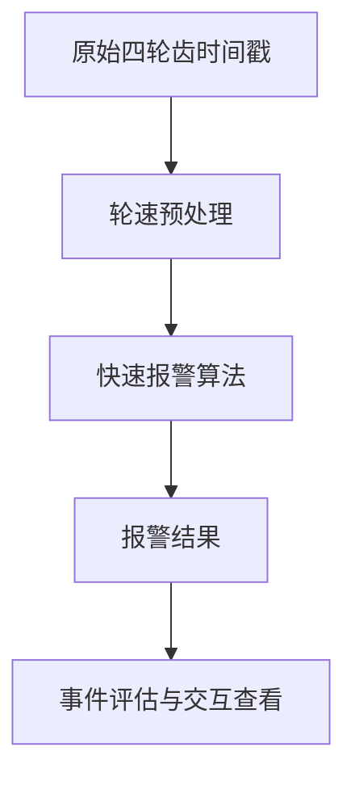
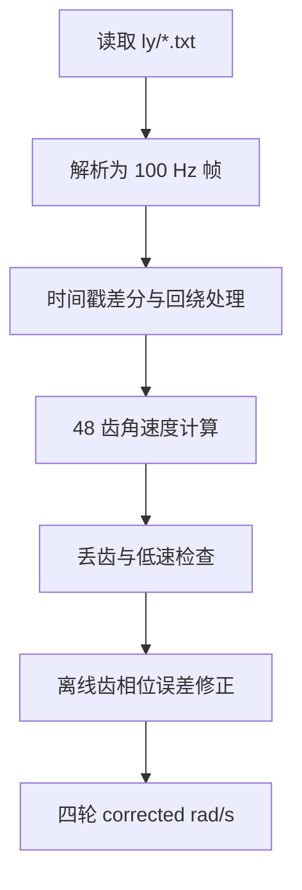
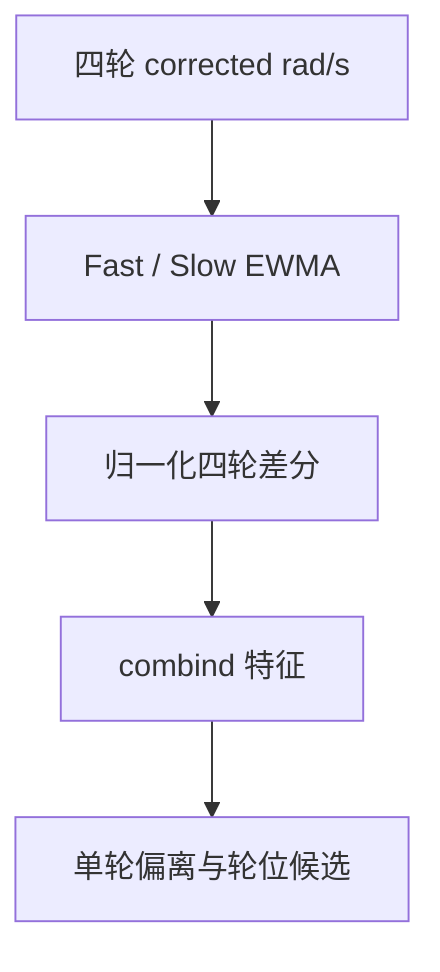
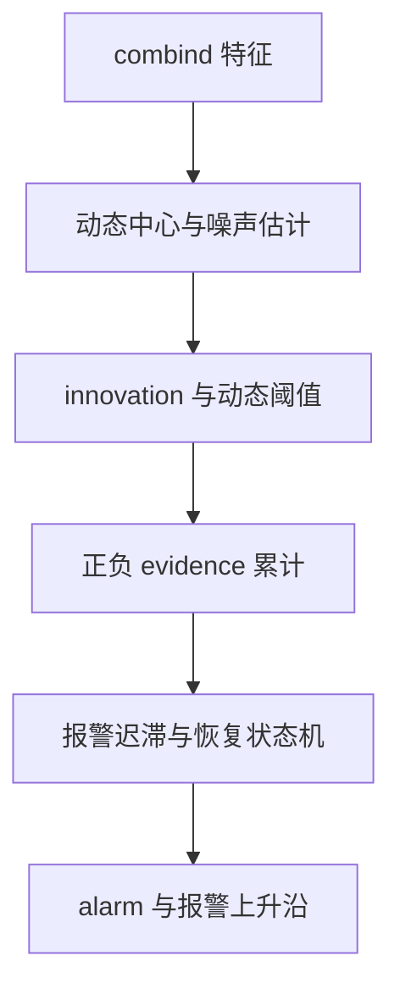
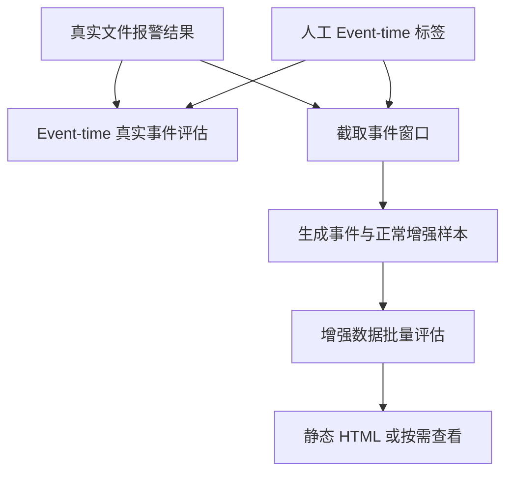
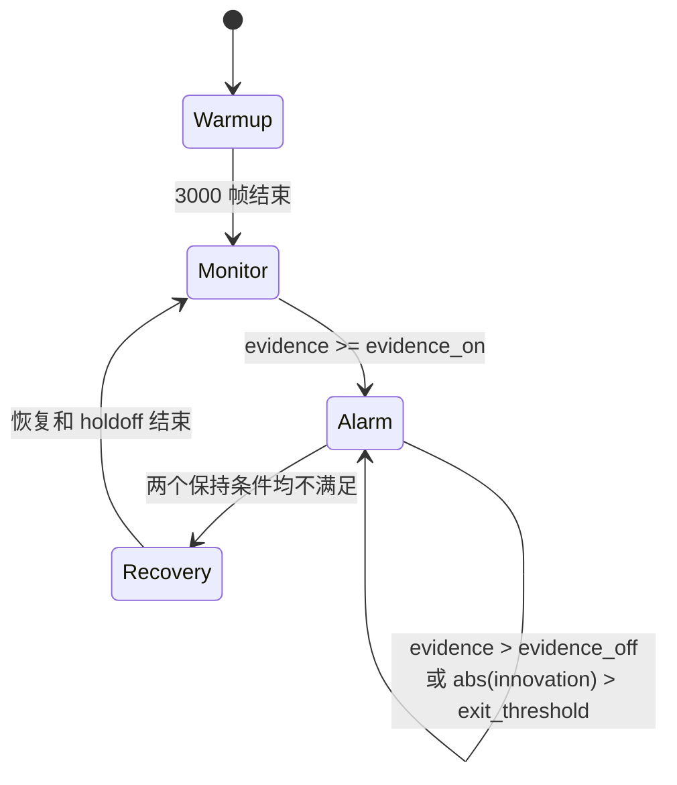

# 爆胎快速报警算法说明

本文档对应当前工程中的四轮轮速爆胎快速报警流程，覆盖原始数据解析、轮速计算与齿误差修正、快慢 EWMA 特征、动态基线、innovation、双向 evidence、报警状态机、事件评估、数据增强和交互查看。

当前算法是**规则与状态机算法**，不是机器学习模型。数据增强用于参数调优和鲁棒性压力测试，不会自动“训练”这个算法，也不能增加真实独立爆胎事件数量。

## 1. 代码入口

| 功能 | 文件 |
|---|---|
| 原始齿时间戳解析、轮速计算、齿误差修正 | [`process_wheel_cog.py`](./wheel_cog_outputs/process_wheel_cog.py) |
| 批量处理 `ly/**/*.txt` | [`batch_process_ly_fast_alarm.py`](./wheel_cog_outputs/batch_process_ly_fast_alarm.py) |
| 批量结果汇总与基础 HTML 展示 | [`process_wheel_speeds_fast_batch_display.py`](./wheel_cog_outputs/process_wheel_speeds_fast_batch_display.py) |
| 快速爆胎报警核心 | [`alarm_detection_local_fast.py`](./wheel_cog_outputs/alarm_detection_local_fast.py) |
| 生成待人工校正的事件时刻参考标签 | [`generate_event_time_labels.py`](./wheel_cog_outputs/generate_event_time_labels.py) |
| 基于 `event_time` 的真实事件评估 | [`evaluate_fast_alarm_with_labels.py`](./wheel_cog_outputs/evaluate_fast_alarm_with_labels.py) |
| 增强数据生成 | [`build_augmented_event_dataset.py`](./wheel_cog_outputs/build_augmented_event_dataset.py) |
| 增强数据批量评价与静态展示 | [`evaluate_augmented_fast_batch_display.py`](./wheel_cog_outputs/evaluate_augmented_fast_batch_display.py) |
| 按需生成图表的动态查看器 | [`serve_augmented_fast_batch_display.py`](./wheel_cog_outputs/serve_augmented_fast_batch_display.py) |

### 1.1 运行环境与首次启动

建议使用 Python 3.10 或更高版本。在仓库根目录创建虚拟环境并安装依赖。

Windows CMD：

```bat
py -m venv .venv
.venv\Scripts\activate
python -m pip install numpy pandas plotly
```

Windows PowerShell：

```powershell
py -m venv .venv
.venv\Scripts\Activate.ps1
python -m pip install numpy pandas plotly
```

Linux / WSL：

```bash
python3 -m venv .venv
source .venv/bin/activate
python -m pip install numpy pandas plotly
```

如需使用 Notebook，再安装并启动 JupyterLab：

```bash
python -m pip install jupyterlab
jupyter lab
```

## 2. 端到端流程

### 2.1 总览



### 2.2 轮速预处理



### 2.3 特征提取



### 2.4 报警判定



### 2.5 评估、增强与查看



默认数据链路是：

```text
ly/*.txt
  -> wheel_speed_raw_vs_corrected.csv
  -> wheel*_corrected_rad_s
  -> fast_ewma_leaky_evidence
  -> alarm_detection_results_fast.csv
```

## 3. 原始数据与轮速预处理

### 3.1 原始文件解析

原始 `ly/*.txt` 文件中，程序从文本行 `marks end` 后开始读取整数数据。

- 每 5 行组成一帧。
- 前 4 行分别对应 `wheel0`～`wheel3`。
- 每个车轮行的第 2～第 17 个整数作为齿时间戳，最多 16 个。
- 每帧间隔固定为 `0.01 s`，即约 `100 Hz`。
- 当前四个车轮均按 `48` 齿处理。

在报警特征中，轮位顺序被解释为：

```text
wheel0 = FL（左前）
wheel1 = FR（右前）
wheel2 = RL（左后）
wheel3 = RR（右后）
```

该映射必须与采集端实际定义一致，否则轮位解释和特征符号都会受到影响。

### 3.2 时间戳差分

相邻齿时间戳的间隔为：

```text
delta = current_timestamp - previous_timestamp
```

计时器按 `65536` 回绕。当差值小于等于 0 时：

```text
delta += 65536
```

时间戳分辨率为 `1000 ns = 1 μs`。

### 3.3 低速判断

每个车轮保存最近 10 帧的齿时间戳数量。如果 10 帧合计少于 10 个齿事件，则认为速度过低：

```text
sum(last_10_frame_tooth_counts) < 10
```

低速帧轮速输出为 0，并重置部分差分历史。这个低速逻辑属于轮速预处理；报警器内部还有独立的 `min_avg_speed` 门槛。

### 3.4 轮速计算

一帧中有 `N` 个有效齿间隔，齿数为 `C=48`，间隔总和为 `ΣΔt`，轮速为：

$$
\omega = \frac{N \cdot 2\pi/C}{\sum \Delta t}
$$

其中 `Δt` 转换为秒，最终单位为 `rad/s`。

### 3.5 疑似丢齿检查

相邻齿间隔变化超过约 `±50%` 时，被标记为疑似丢齿或异常齿间隔。这部分逻辑用于参考 Rust 流程和修正诊断。

### 3.6 离线齿相位误差修正

默认报警使用 `corrected` 轮速。离线修正的大致过程是：

1. 将连续齿间隔按照 `phase = 0...47` 对齐。
2. 每 48 个齿间隔组成一圈。
3. 如果某一圈存在小于中位数 `0.5 倍`或大于 `1.5 倍`的间隔，则拒绝该圈。
4. 对每个 phase 计算：

$$
factor_p \approx \mathrm{median}\left(\frac{\Delta t_p}{\text{lap mean}}\right)
$$

5. 将 48 个 factor 归一化，使其平均值为 1。
6. 修正间隔：

$$
\Delta t_{corrected} = \frac{\Delta t_{raw}}{factor_p}
$$

7. 使用修正后的间隔重新计算轮速。

处理后主要输出：

```text
wheel_speed_raw_vs_corrected.csv
learned_tooth_correction_factors.csv
correction_quality_metrics.csv
```

`wheel_speed_raw_vs_corrected.csv` 包含：

```text
time_s
wheel0_raw_rad_s ... wheel3_raw_rad_s
wheel0_corrected_rad_s ... wheel3_corrected_rad_s
wheel0_ref_comp_on_rad_s ... wheel3_ref_comp_on_rad_s
wheel0_delta_count ... wheel3_delta_count
```

> **因果性注意：** 当前 `corrected` 相位因子由整段文件中的齿事件离线学习，然后回头修正整段轮速，因此可能使用到事件发生后的数据。它适合离线算法研究，但不等同于严格实时预处理。真实部署和严格盲测应使用事先标定的固定因子，或只用当前时刻之前的数据在线学习，并在疑似事件前冻结。

## 4. 快慢 EWMA 特征

报警器每帧接收：

```text
WheelSpeedFrame(time_s, [wheel0, wheel1, wheel2, wheel3])
```

默认读取 `wheel*_corrected_rad_s`。

### 4.1 Fast EWMA

每个车轮维护快速跟踪值：

$$
fast_i(t) = fast_i(t-1) + \alpha_f(x_i(t)-fast_i(t-1))
$$

默认：

```text
fast_alpha = 0.45
```

它能快速响应轮速的突然变化。

### 4.2 Slow EWMA

每个车轮同时维护正常状态慢基线：

$$
slow_i(t) = slow_i(t-1) + \alpha_s(x_i(t)-slow_i(t-1))
$$

默认：

```text
slow_alpha = 0.0010466746
```

在 100 Hz 下，其变化明显慢于 fast，用来表示较长期的正常四轮关系。发生疑似异常、报警或证据较强时，slow 可能被冻结，避免把爆胎异常学习成新的正常状态。

### 4.3 归一化四轮差分

设：

```text
fl = wheel0
fr = wheel1
rl = wheel2
rr = wheel3
norm = 4 / (fl + fr + rl + rr)
```

构造四个归一化差分：

$$
D_0 = (fl-fr) \cdot norm
$$

$$
D_1 = (rl-rr) \cdot norm
$$

$$
D_2 = (rl-fl) \cdot norm
$$

$$
D_3 = (rr-fr) \cdot norm
$$

分别对 fast 和 slow 计算 `D`，再取残差：

$$
R_j = D_{slow,j} - D_{fast,j}
$$

组合特征为：

$$
raw\_feature = 0.5(R_0 + R_3 - R_2 - R_1)
$$

然后再做一次 EWMA：

$$
filtered(t) = filtered(t-1) + \alpha_{filter}(raw\_feature-filtered(t-1))
$$

最终：

$$
legacy\_combind = filtered \cdot output\_scale
$$

默认参数：

```text
filter_alpha = 0.65
output_scale = 200
```

代码和输出中保留了拼写 `combind`，它表示最终送入检测器的综合特征。

### 4.4 单轮相对偏离与轮位候选

每个轮胎还会计算相对另外三个轮胎均值的偏离：

$$
dev_i = \frac{wheel_i}{mean(other\ 3\ wheels)} - 1
$$

比较 fast 与 slow 的偏离，并乘 100：

$$
wheel\_residual_i = (dev_{fast,i}-dev_{slow,i}) \cdot 100
$$

绝对值最大的车轮作为 `alarm_wheel` 候选。

当前配置：

```text
use_wheel_feature = False
```

因此报警判定默认使用 `legacy_combind`，单轮特征主要用于辅助轮位解释。当前轮位输出尚不能视为已经独立验证的轮位分类结果。

## 5. 动态中心、噪声与 Innovation

综合特征记为 `x`，检测器维护动态中心 `center`：

$$
innovation = x-center
$$

含义：

- `innovation ≈ 0`：当前四轮关系接近正常基线。
- `innovation > 0`：向正方向偏离。
- `innovation < 0`：向负方向偏离。
- `|innovation|` 越大：当前帧越异常。

正常且未报警时，中心更新：

$$
center \leftarrow center + \alpha_c(x-center)
$$

默认：

```text
center_alpha = 0.0435206346
```

噪声估计采用 innovation 的绝对值：

$$
noise \leftarrow noise + \alpha_n(|innovation|-noise)
$$

并保证：

```text
noise >= noise_floor
```

默认：

```text
noise_alpha = 0.004021395
noise_floor = 0.08
```

动态进入阈值：

$$
enter\_threshold = \max(enter\_min, enter\_noise\_gain \cdot noise)
$$

动态退出阈值：

$$
exit\_threshold = \max(exit\_min, exit\_noise\_gain \cdot noise)
$$

数据越颠簸，noise 越大，阈值越高，从而降低误报概率。

## 6. 双向 Leaky Evidence

算法分别累计正方向和负方向证据，因此能检测两种符号的轮速关系突变。

首先限制单帧输入：

$$
z = clip(innovation, -evidence\_input\_cap, evidence\_input\_cap)
$$

正向证据：

$$
E_+(t) = \max(0, decay \cdot E_+(t-1) + z-enter\_threshold)
$$

负向证据：

$$
E_-(t) = \max(0, decay \cdot E_-(t-1) - z-enter\_threshold)
$$

最终分数：

$$
score = evidence = \max(E_+, E_-)
$$

`signed_evidence` 使用占优证据的符号：

```text
E+ 较大 -> signed_evidence = +E+
E- 较大 -> signed_evidence = -E-
```

因此：

```text
innovation = 当前一帧偏离了多少
evidence   = 偏离是否连续积累到足够可信
```

短暂越过 innovation 阈值不一定报警；持续越界更容易使 evidence 达到报警阈值。

## 7. 报警迟滞与状态机

### 7.1 进入报警

未报警状态下，满足下列任一条件进入报警：

```text
evidence >= evidence_on
或
abs(innovation) >= instant_on
```

当前 `instant_on = 999`，在现有特征尺度上相当于基本关闭单帧瞬时报警，因此主要依赖 evidence 累计。

### 7.2 保持和退出报警

已经报警时，只要满足下列任一条件就保持报警：

```text
evidence > evidence_off
或
abs(innovation) > exit_threshold
```

退出门槛比进入门槛低，形成迟滞，避免报警在阈值附近快速开关。

### 7.3 状态流程



### 7.4 Warmup

```text
warmup_frames = 3000
```

采样率为 100 Hz 时，对应约 30 秒。Warmup 内：

- 可以建立快慢特征、中心和噪声状态。
- 强制清空 evidence。
- 强制 `alarm=False`。

因此直接回放当前算法的样本需要保留至少 30 秒事件前数据。增强样本默认保留 40 秒事件前数据。

### 7.5 速度门槛

四轮平均角速度：

$$
avg\_speed = \frac{wheel0+wheel1+wheel2+wheel3}{4}
$$

默认有效门槛：

```text
min_avg_speed = 20 rad/s
```

若轮胎半径约为 `0.31 m`，这大致对应 `22.3 km/h`，但半径并没有直接参与当前报警代码。

低于门槛时：

- 若之前未报警，清空 evidence 并保持不报警。
- 若之前已经报警且 `hold_alarm_below_min_speed=True`，继续保持报警。

### 7.6 Slow 冻结

正常监测时，只有在 evidence 较低时才更新 slow：

```text
score < freeze_enter
```

默认：

```text
freeze_enter = 0.382258
```

当异常证据开始积累时冻结 slow，可以避免异常迅速进入正常基线。

### 7.7 Recovery

报警退出后进入恢复阶段：

```text
recovery_frames = 100          # 名义约 1 秒
recovery_holdoff_frames = 20   # 名义约 0.2 秒
```

恢复期间使用更快的参数让 slow、center 和 noise 重新靠近当前稳定信号：

```text
recovery_slow_alpha   = 0.08
recovery_center_alpha = 0.20
recovery_noise_alpha  = 0.05
```

holdoff 期间强制清空 evidence 且不允许重新报警，用于减少一次异常结束后的重复触发。

## 8. 默认参数表

| 参数 | 默认值 | 作用 |
|---|---:|---|
| `min_avg_speed` | 20.0 | 最低有效平均轮速，单位 rad/s |
| `fast_alpha` | 0.45 | 快轮速 EWMA 响应速度 |
| `slow_alpha` | 0.001046675 | 慢基线 EWMA 响应速度 |
| `filter_alpha` | 0.65 | 综合残差再次滤波 |
| `output_scale` | 200.0 | 综合特征缩放 |
| `use_wheel_feature` | False | 是否将单轮偏离特征用于报警判定 |
| `warmup_frames` | 3000 | 预热帧数 |
| `noise_alpha` | 0.004021395 | 正常噪声自适应速度 |
| `center_alpha` | 0.043520635 | 特征中心自适应速度 |
| `noise_floor` | 0.08 | 噪声估计下限 |
| `enter_min` | 0.747684 | innovation 进入阈值下限 |
| `enter_noise_gain` | 3.140654 | 噪声到进入阈值的倍率 |
| `exit_min` | 0.192854 | innovation 退出阈值下限 |
| `exit_noise_gain` | 2.605008 | 噪声到退出阈值的倍率 |
| `evidence_decay` | 0.970937 | evidence 每帧保留比例 |
| `evidence_on` | 1.419129 | evidence 报警进入阈值 |
| `evidence_off` | 0.284945 | evidence 报警退出阈值 |
| `evidence_input_cap` | 1.10 | 单帧 innovation 对 evidence 的最大贡献输入 |
| `instant_on` | 999.0 | 单帧瞬时报警阈值，当前基本关闭 |
| `freeze_enter` | 0.382258 | slow 基线冻结门槛 |
| `recovery_enabled` | True | 是否启用报警退出后的恢复阶段 |
| `recovery_frames` | 100 | 恢复时长 |
| `recovery_holdoff_frames` | 20 | 恢复期禁止重报时长 |
| `recovery_slow_alpha` | 0.08 | 恢复期 slow 更新速度 |
| `recovery_center_alpha` | 0.20 | 恢复期中心更新速度 |
| `recovery_noise_alpha` | 0.05 | 恢复期噪声更新速度 |
| `hold_alarm_below_min_speed` | True | 已报警后进入低速是否继续保持报警 |

## 9. 输出字段

`alarm_detection_results_fast.csv` 每帧包含：

| 字段 | 含义 |
|---|---|
| `time_s` | 当前时间 |
| `wheel0_rad_s...wheel3_rad_s` | 四轮输入轮速 |
| `avg_speed_rad_s` | 四轮平均轮速 |
| `combind` | 当前实际送入检测器的综合特征 |
| `legacy_combind` | 归一化四轮差分组合特征 |
| `wheel_feature` | 最大单轮相对偏离特征 |
| `feature_baseline` | 动态特征中心 `center` |
| `innovation` | `combind - feature_baseline` |
| `alarm` | 当前报警状态，0/1 |
| `score` / `evidence` | 正负 evidence 最大值 |
| `signed_evidence` | 带方向的占优 evidence |
| `enter_threshold` | innovation 进入证据阈值 |
| `exit_threshold` | 报警保持使用的 innovation 阈值 |
| `on_threshold` | evidence 报警进入阈值 |
| `off_threshold` | evidence 报警退出阈值 |
| `noise` | 当前噪声估计 |
| `recovery_active` | 是否处于恢复阶段 |
| `alarm_wheel` | 最大相对偏离车轮候选 |
| `alarm_wheel_dev` | 对应单轮相对偏离 |

## 10. 三层交互图怎么读

### 第一层：Wheel speed

显示四个车轮的 `rad/s`。爆胎、打滑、急转弯、颠簸或采样异常都可能造成轮速关系变化。

### 第二层：Innovation and thresholds

显示：

```text
innovation
+enter_threshold
-enter_threshold
```

innovation 在阈值内部通常表示当前帧没有足够强的异常贡献；持续越过正阈值或负阈值会分别累计正/负 evidence。

### 第三层：Evidence

显示：

```text
signed_evidence
+evidence_on
-evidence_on
```

evidence 达到进入阈值后触发报警。

图中附加标记：

```text
绿色虚线     = event_time
绿色浅色区域 = [event_time, event_time + 检测时限]
红色区域     = 算法 alarm=True
灰色点线     = 30 秒 warmup 结束
```

## 11. Event-time 标签与真实事件评估

正式标签只保存文件名和事件时刻：

```csv
file,event_time_s
20260116_yuan_baotai_rr100_45kmh.txt,402.16
```

可先用当前算法的首次确认报警时刻生成参考文件：

```bash
python wheel_cog_outputs/generate_event_time_labels.py
```

默认输出到：

```text
wheel_cog_outputs/blowout_manual_labeling_package/labeling_package/event_time_labels_reference.csv
```

这个结果只是方便人工定位的参考值，不能直接当作真值。应结合原始轮速、试验记录和交互图逐条修正 `event_time_s`，保存为正式标签后再进行评估。

评估使用报警状态的**上升沿**，而不是报警覆盖帧数。

设真实爆胎时刻为 `T`，首次有效报警上升沿为 `A`：

$$
delay = A-T
$$

默认主要指标：

```text
0 <= delay <= 2 秒 -> 2 秒内检出
没有有效上升沿     -> 漏报
T 之前报警上升沿   -> 爆胎前误报
```

脚本同时报告：

- 1 秒、2 秒、5 秒内检出率。
- 平均、中位数和最大检测延迟。
- 爆胎前误报事件数。
- 有效正常时长和每小时误报事件数。

默认从第 30 秒以后统计正常暴露时间，排除算法自身不会报警的 warmup。

如果一次报警在爆胎前已经开始并持续越过 `event_time`，它不会被错误地当作 `delay=0` 的正确检测；它属于提前误报，除非之后出现新的有效报警上升沿。

运行：

```bash
python wheel_cog_outputs/evaluate_fast_alarm_with_labels.py
```

## 12. 数据增强流程

增强样本默认长度为 50 秒：

```text
事件前 40 秒 + 事件后 10 秒
```

这样可以满足当前算法约 30 秒 warmup 的要求。

每个真实事件默认生成：

```text
1 个未增强基准事件样本
50 个增强事件样本
10 个增强正常样本
```

8 个真实事件最终得到：

```text
408 个事件样本 = 8 × (1 + 50)
80 个正常样本  = 8 × 10
总计 488 个样本
```

### 12.1 事件位置与时间伸缩

设原始事件时间为 `T`，增强样本内事件位置为 `T_local`，时间伸缩为 `s`，输出样本时间为 `t_local`。查询原始数据的时间为：

$$
t_{source} = T + \frac{t_{local}-T_{local}}{s}
$$

默认：

```text
T_local = 40 秒 ± 0.5 秒
s       = 0.95～1.05
```

四轮同步插值，增强后的 `T_local` 写入 `manifest.csv` 的 `event_time_in_sample_s`。

### 12.2 速度缩放

四轮共同乘同一个系数：

```text
speed_scale = 0.95～1.05
```

共同缩放避免人为制造不合理的轮间差异。

### 12.3 真实噪声叠加

从 `event_time - 10 秒`之前的正常数据构建噪声池：

1. 用 21 点中心滑动平均提取慢变化。
2. `noise = normal - smooth`。
3. 随机抽取连续噪声片段。
4. 以 `0.10～0.50` 的 gain 叠加到事件或正常样本。

### 12.4 采样丢失

默认以 30% 概率模拟连续 `1～3` 个采样点丢失，然后用线性插值恢复。

### 12.5 正常样本

正常样本随机取自：

```text
[文件开始, event_time - 10 秒 - 样本长度]
```

确保正常窗口与爆胎事件之间至少保留 10 秒隔离。

### 12.6 分组隔离

`manifest.csv` 中的 `source_event_id` 是最重要的隔离字段。

```text
E01 生成的所有原始、增强和正常样本都仍属于 E01
```

训练/调参和测试必须按 `source_event_id` 分组。测试 E01 时，任何 E01 增强样本都不能进入训练或调参数据。

增强后的 400 个事件版本不等于 400 个独立真实爆胎；真实事件分母仍然是 8。

运行：

```bash
python wheel_cog_outputs/build_augmented_event_dataset.py
```

## 13. 增强数据评价和查看

批量计算增强样本指标但不预生成 HTML：

```bash
python wheel_cog_outputs/evaluate_augmented_fast_batch_display.py --html-mode none
```

启动动态查看器：

```bash
python wheel_cog_outputs/serve_augmented_fast_batch_display.py
```

浏览器打开：

```text
http://localhost:8765
```

首页显示全部 488 个样本。点击某个 `sample_id` 时，服务器才读取该 CSV、重新运行算法并生成 Plotly 图，不需要提前保存 488 个静态 HTML。

## 14. 完整运行顺序

### 14.1 批量处理原始文件并运行算法

```bash
python wheel_cog_outputs/batch_process_ly_fast_alarm.py
```

该命令：

1. 扫描 `ly/**/*.txt`。
2. 计算 raw/corrected/ref-comp 四轮轮速。
3. 默认用 corrected 轮速运行快速报警。
4. 写入每个 case 的报警结果。
5. 更新 `fast_alarm_batch_summary.csv`。

### 14.2 评估真实事件

```bash
python wheel_cog_outputs/evaluate_fast_alarm_with_labels.py
```

### 14.3 生成增强数据

```bash
python wheel_cog_outputs/build_augmented_event_dataset.py \
  --aug-per-event 50 \
  --normal-per-event 10
```

### 14.4 评价增强数据

```bash
python wheel_cog_outputs/evaluate_augmented_fast_batch_display.py \
  --html-mode none
```

### 14.5 动态查看全部样本

```bash
python wheel_cog_outputs/serve_augmented_fast_batch_display.py
```

## 15. 当前结果快照

以下仅是 2026-07-13 当前数据和参数的流程快照。

### 15.1 8 个完整真实文件

```text
2 秒内检出：8/8
平均延迟：约 0.121 秒
最大延迟：约 0.150 秒
爆胎前有效正常时长：约 0.780 小时
爆胎前误报事件：0
```

### 15.2 增强数据

```text
未增强基准事件：8/8 在 2 秒内检出
增强事件：396/400 在 2 秒内检出
提前报警样本：5
漏报样本：1
增强正常样本误报：2/80
增强正常误报事件：3
检测延迟中位数：约 0.124 秒
检测延迟 P95：约 0.147 秒
```

增强数据指标是压力测试结果，不是真实道路召回率或真实误报率。

## 16. 参数变化方向

| 调整 | 一般影响 |
|---|---|
| 提高 `enter_min` | innovation 更难形成 evidence，误报可能下降，检测可能变慢或漏报增加 |
| 提高 `enter_noise_gain` | 颠簸场景阈值更高，抗噪增强，但弱爆胎可能变难检出 |
| 提高 `evidence_on` | 需要更多累计证据，误报下降、延迟增加 |
| `evidence_decay` 更接近 1 | evidence 记忆更长，弱持续异常更容易触发，也可能增加误报 |
| 降低 `evidence_input_cap` | 限制强单帧冲击，降低突发噪声影响，但可能增加检测延迟 |
| 提高 `center_alpha` | 中心更快追踪变化，长期漂移适应更快，也可能吸收真实异常 |
| 提高 `noise_alpha` | 阈值更快跟随噪声变化，可能抑制颠簸，也可能在异常开始时快速抬高阈值 |
| 降低 `freeze_enter` | 更早冻结 slow，减少异常被基线吸收，但对正常工况变化更敏感 |
| 延长 `warmup_frames` | 初始状态更稳定，但系统更晚具备报警能力 |

参数调优必须在按 `source_event_id` 隔离的数据上进行，测试事件不能参与参数选择。

## 17. 已知限制与风险

1. **真实爆胎事件只有 8 个。** 即使 8/8 检出，也不足以证明真实召回率接近 100%。
2. **当前 `event_time` 最初参考了同一算法的报警点，再进行人工调整。** 如果没有视频、触发器或独立传感器确认，会产生循环验证风险，使延迟结果偏乐观。
3. **正常道路暴露时间不足。** 当前约 0.78 小时的爆胎前正常数据无法证明低误报率，仍需要长时间独立正常道路数据。
4. **增强样本高度相关。** 400 个增强事件仍然只来源于 8 个真实事件。
5. **轮位输出未独立验证。** 默认报警特征并不直接使用 `wheel_feature`，`alarm_wheel` 只能当辅助候选。
6. **参数精度很高且样本很少。** 当前参数可能对现有数据过拟合，需要留一事件验证和新车辆、新道路盲测。
7. **速度门槛使用角速度。** `20 rad/s` 对应的车速依赖轮胎半径，跨车型时需要重新确认。
8. **转弯、制动、坑洼、打滑和传感器异常可能产生相似轮速关系变化。** 必须用大量真实 hard negative 数据验证。
9. **算法在低速时可保持已有报警。** 这是当前状态机的明确策略，需要确认是否符合产品需求。
10. **预处理映射必须正确。** wheel0～wheel3 的真实安装轮位或采集顺序错误会直接影响组合特征和轮位解释。
11. **默认 corrected 轮速存在离线前视。** 齿相位 factor 当前从完整记录学习，可能包含事件后的信息；部署评估前必须改成预标定或严格因果学习方式。

## 18. 建议的下一步

1. 使用视频、试验触发器或独立信号重新确认 8 个 `event_time`。
2. 按车辆/完整事件做 leave-one-event-out 调参，禁止增强数据跨组泄漏。
3. 增加急刹、急转弯、坑洼、减速带、低胎压、慢漏气、打滑和传感器异常的真实正常数据。
4. 真实指标固定报告：事件召回率、1/2/5 秒检出率、延迟中位数/P95/最大值、每 100 小时或每 1000 公里误报数。
5. 将轮位检测作为独立任务评估，不与“是否爆胎”混成一个指标。
6. 在新车辆、新轮胎和未见路况上进行完全独立盲测。
